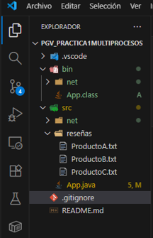

## Proyecto: Analizador Multiproceso de Reseñas de Clientes

## Descripción general

Esta aplicación en Java analiza reseñas de productos de forma paralela utilizando procesos independientes.
El objetivo es evaluar la satisfacción de los clientes mediante la detección de reseñas positivas, negativas o neutras, mejorando así la toma de decisiones en la empresa.

## Justificación empresarial

Una empresa de comercio electrónico recibe a diario miles de reseñas de clientes sobre sus productos.
Revisar cada comentario manualmente sería lento e ineficiente.
Gracias a esta aplicación multiproceso, se pueden analizar simultáneamente varios ficheros de reseñas (uno por producto o por día), permitiendo conocer rápidamente:

El porcentaje de opiniones positivas por producto.

El nivel de satisfacción global de los clientes.

Qué productos necesitan mejoras o atención especial.

Con esto, la empresa puede detectar problemas más rápido y mejorar su reputación online.

## Funcionamiento técnico

## Proceso principal (Main.java)

Busca ficheros en la carpeta /reseñas.

Crea un subproceso por cada archivo, utilizando ProcessBuilder.

Cada subproceso ejecuta Analizador.java con el nombre del archivo como argumento.

Redirige la salida de cada subproceso a un fichero en /salidas.

Espera que todos los subprocesos terminen y luego resume los resultados globales en consola.

## Subproceso (Analizador.java)

Recibe el nombre de un archivo de reseñas.

Clasifica las reseñas según palabras clave:

Positivas: “excelente”, “bueno”, “recomendado”, “fantástico”, “genial”.

Negativas: “malo”, “defectuoso”, “caro”, “horrible”, “pésimo”.

Calcula estadísticas (totales y porcentajes).

Imprime los resultados (redirigidos por el proceso principal a un fichero de salida).

## Ejecución paso a paso

# Ejecutar

java -cp bin App

## FUNCIONAMIENTO DE LA APLICACIÓN:

#
